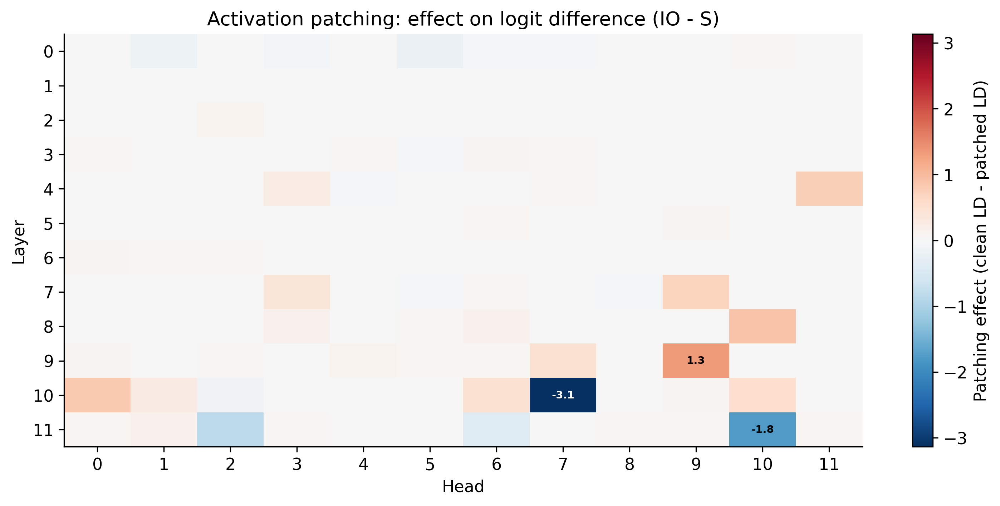
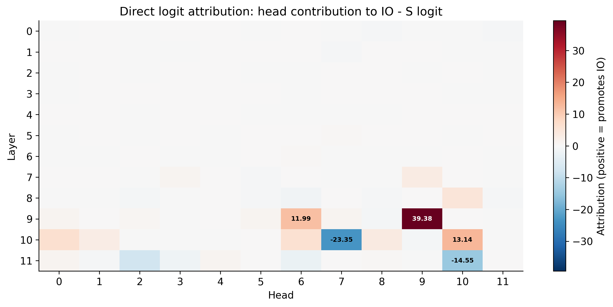
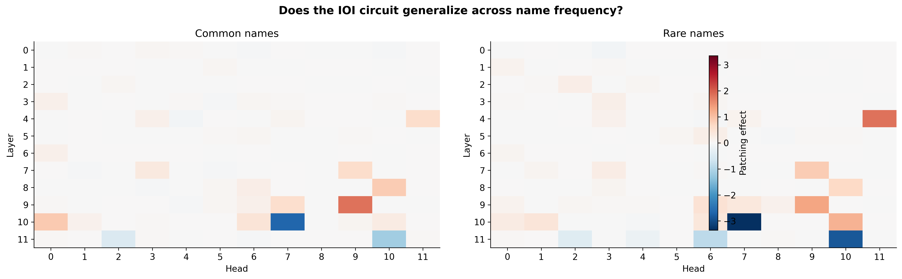
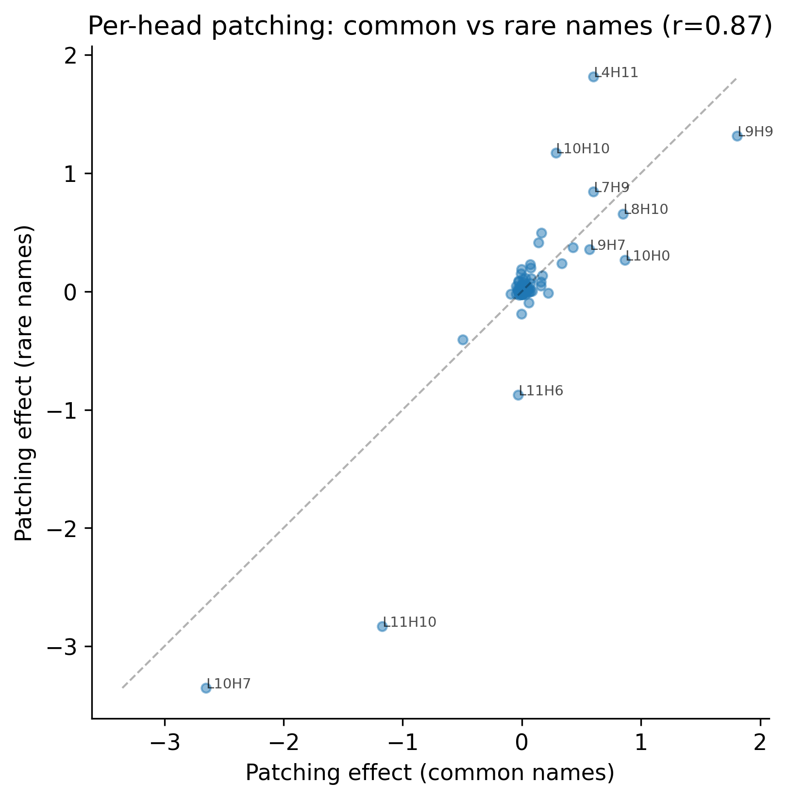
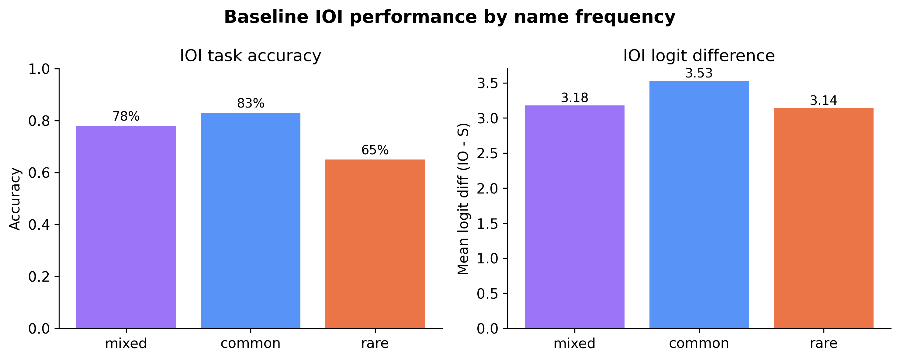

# IOI Circuit Analysis in GPT-2 Small: Activation Patching and Name Frequency Generalization

Identifying the circuit for indirect object identification (IOI) in GPT-2 Small using activation patching and direct logit attribution, with an extension testing whether the circuit generalizes across name frequencies.

## Research Question

Which attention heads in GPT-2 Small implement the IOI task ("When Mary and John went to the store, John gave a drink to ___" → Mary), and does the same circuit handle common names (John, Mary) and rare names (Dmitri, Yuki)?

## Key Findings

**The IOI circuit is concentrated in a small set of late-layer heads.** Activation patching identifies L9H9 (effect: 1.34), L8H10 (0.90), L10H0 (0.83), and L4H11 (0.74) as the most important positive contributors. These heads are necessary for the model to predict the indirect object over the subject. L10H7 is the strongest negative mover (effect: −3.14), actively pushing toward the subject name — consistent with the "S-inhibition" heads described in Wang et al. (2022).

**Direct logit attribution reveals even sharper concentration.** L9H9 contributes +39.4 to the IO−S logit difference, followed by L10H10 (+13.1), L9H6 (+12.0), and L10H0 (+6.2). The negative movers are L10H7 (−23.3), L11H10 (−14.6), and L11H2 (−7.5). The attribution magnitudes are much larger than patching effects because attribution measures the direct contribution to the logit while patching measures the causal effect of removal, which can be partially compensated by other heads.

**The circuit generalizes across name frequency (r = 0.87).** The per-head patching effects for common and rare names are highly correlated. The same heads matter in both conditions: L9H9, L8H10, L7H9, and L10H7 appear as top contributors for both name groups. This suggests the IOI circuit operates on syntactic structure (which entity was mentioned first, which was repeated) rather than relying on memorized name-specific associations.

**Performance is lower for rare names, but the circuit is the same.** Accuracy drops from 83% (common) to 65% (rare), and logit difference drops from 3.53 to 3.14. The model is less confident on rare names, but it uses the same computational pathway — the circuit generalizes even as raw performance degrades.

## Results

### Head-Level Activation Patching



Each cell shows how much the IO−S logit difference drops when that head's output is replaced with the corrupted (names-swapped) version. Red = important for correct prediction. Blue = pushes toward the wrong answer. The circuit is sparse: most heads have near-zero effect.

### Direct Logit Attribution



Each head's direct contribution to the IO−S logit at the final token. L9H9 dominates (+39.4), acting as the primary "name mover" head. The late-layer negative heads (L10H7 at −23.3, L11H10 at −14.6) are "backup" or "S-inhibition" mechanisms.

### Name Frequency Comparison



Side-by-side patching heatmaps for common and rare names. The overall pattern is preserved: the same heads are important in both conditions, with some variation in magnitude.

### Per-Head Scatter: Common vs Rare



Each point is one attention head. The correlation is r = 0.87, indicating strong generalization. Key circuit heads (L9H9, L8H10, L7H9, L10H7) cluster in the same relative positions for both name groups.

### Baseline Performance



The model performs the IOI task well above chance for all name groups. Common names are easier (83% accuracy, 3.53 logit diff) than rare names (65%, 3.14), consistent with the model having seen common names more during pre-training.

## Method

**Task.** Indirect Object Identification: "When [IO] and [S] went to the [place], [S] gave a [object] to ___" → model should predict IO. We use 5 template variants with both normal and reversed name ordering, 10 common names (John, Mary, ...), 10 rare names (Dmitri, Yuki, ...), and random places/objects.

**Activation patching.** For each of the 144 attention heads (12 layers × 12 heads): run the clean prompt, replace that head's output (at `hook_z`) with its output on the corrupted prompt (IO and S names swapped), and measure the drop in logit difference. A large drop means the head is causally important.

**Direct logit attribution.** Decompose the IO−S logit difference into per-head contributions by projecting each head's output through the unembedding matrix in the IO−S direction.

**Name frequency comparison.** Run the full patching experiment separately on common-only and rare-only name sets. Compare per-head effects via Pearson correlation.

## Limitations

- **Layer patching was uninformative.** Patching the full residual stream at each layer gave identical effects across all layers (6.77), likely because replacing the entire residual at any layer destroys nearly all task-relevant information. A more targeted approach (patching only specific token positions) would be needed.
- **Template diversity.** Five templates with a fixed structure may not capture the full range of IOI-like constructions the model can handle.
- **No attention pattern analysis.** We identify which heads matter but don't analyze what they attend to. Adding attention pattern visualizations would clarify the mechanistic story (e.g., confirming that name mover heads attend to the IO name).
- **Single metric.** We use logit difference as the sole metric. Adding KL divergence or probability-based measures would provide a more complete picture.

## Related Work

- Wang et al. (2022). *Interpretability in the Wild: a Circuit for Indirect Object Identification in GPT-2 Small.* The original IOI paper — our results replicate their core finding of name mover heads at L9H9, L9H6, L10H0.
- Conmy et al. (2023). *Towards Automated Circuit Discovery for Mechanistic Interpretability.*
- Nanda (2023). *200 Concrete Open Problems in Mechanistic Interpretability.*

## Reproducing

```bash
pip install torch transformer_lens transformers einops jaxtyping numpy matplotlib tqdm

mkdir -p results/figures results/data
python src/step_01_baseline.py
python src/step_02_patching.py
python src/step_03_figures.py
```

## Project Structure

```
├── README.md
├── src/
│   ├── config.py              # Configuration, IOI dataset generation
│   ├── step_01_baseline.py    # Task performance + logit attribution
│   ├── step_02_patching.py    # Activation patching (head + layer)
│   └── step_03_figures.py     # Figure generation
└── results/
    ├── data/
    │   ├── baseline_performance.json
    │   ├── logit_attribution.json
    │   └── head_patching.json
    └── figures/
        ├── fig1_head_patching.png
        ├── fig2_logit_attribution.png
        ├── fig4_name_frequency.png
        ├── fig5_name_scatter.png
        └── fig6_baseline_comparison.png
```

## Tools

- [TransformerLens](https://github.com/TransformerLensOrg/TransformerLens)
- PyTorch, matplotlib

## License

MIT